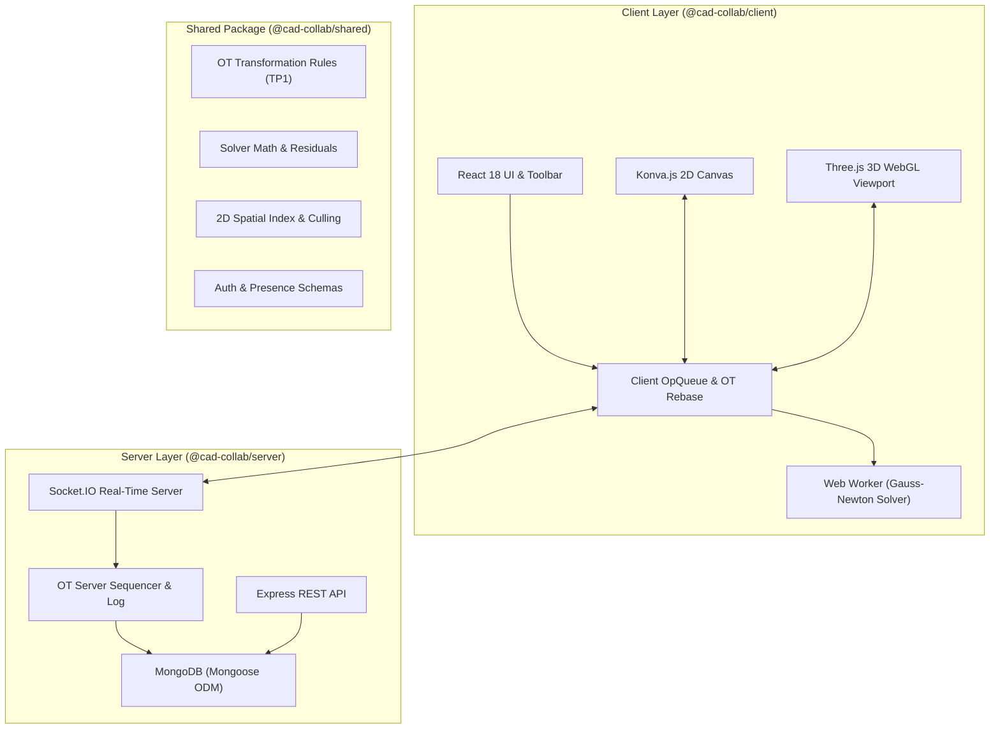

# Architectural Design Specification — CAD Collab (Stitch)

CAD Collab (Stitch) is a real-time collaborative 2D/3D parametric Computer-Aided Design (CAD) engine built with **Operational Transformation (OT)**, an iterative **Gauss-Newton Geometric Constraint Solver**, a **Three.js WebGL 3D Extrusion Engine**, and **WebSocket Presence**.

---

## 1. High-Level System Architecture



---

## 2. Operational Transformation (OT) Engine

### 2.1 Operation Model
Every user operation is serialized as a deterministic payload:
```ts
export interface BaseOp {
  opId: string;        // UUIDv4 unique operation identifier
  docId: string;       // Target CAD document ID
  clientId: string;    // Client UUID or Authenticated User ID
  timestamp: number;   // Epoch timestamp (ms)
  seq?: number;        // Global server sequence number
  refSeq: number;      // Base sequence number client saw when creating op
}
```

Operation Types:
- **`move`**: Position translation delta `(dx, dy)` on geometric primitives or specific vertex handle points.
- **`create`**: Instantiation of `line`, `circle`, or `rectangle` primitives with attributes.
- **`addConstraint`**: Enforces geometric constraints (`coincident`, `parallel`, `perpendicular`, `fixedDistance`).
- **`removeConstraint`**: Removes an existing constraint by ID.

### 2.2 Transformation Rules & TP1 Convergence
When two client operations $O_A$ and $O_B$ are generated concurrently at the same `refSeq`, the transformation function $T(O_A, O_B) \rightarrow (O_A', O_B')$ satisfies:

$$\text{Apply}(S, O_A \circ O_B') \equiv \text{Apply}(S, O_B \circ O_A')$$

- **Move vs. Move ($T_{\text{move, move}}$)**: Position deltas on identical objects are commutative:
  $$\Delta_{\text{final}} = \Delta_A + \Delta_B$$
- **Move vs. Constraint ($T_{\text{move, constraint}}$)**: If a constraint is added concurrently with a shape move, the move operation is re-based against the newly constrained state.

---

## 3. Geometric Constraint Solver Engine

The geometric constraint solver enforces 2D CAD relationships using an iterative **Gauss-Newton solver** executing inside a dedicated **Web Worker thread** (`constraintSolver.worker.ts`) to avoid blocking the main 60 FPS rendering thread.

### 3.1 Supported Constraints
1. **`coincident`**: Forces two point coordinates $(x_1, y_1)$ and $(x_2, y_2)$ to share identical coordinates:
   $$R = \sqrt{(x_1 - x_2)^2 + (y_1 - y_2)^2} = 0$$
2. **`parallel`**: Forces two line vectors $\mathbf{v}_1$ and $\mathbf{v}_2$ to have a cross product equal to zero:
   $$R = \mathbf{v}_1 \times \mathbf{v}_2 = x_1 y_2 - y_1 x_2 = 0$$
3. **`perpendicular`**: Forces two line vectors to have a dot product equal to zero:
   $$R = \mathbf{v}_1 \cdot \mathbf{v}_2 = x_1 x_2 + y_1 y_2 = 0$$
4. **`fixedDistance`**: Preserves a strict scalar distance $d$ between two points:
   $$R = \sqrt{(x_2 - x_1)^2 + (y_2 - y_1)^2} - d = 0$$

---

## 4. 3D WebGL Viewport & Parametric Extrusion Engine

The 3D engine converts 2D parametric sketches into 3D solid geometries in real time using **Three.js**:

```
[2D Konva Sketch] ──► [Extrusion Pipeline] ──► [Three.js 3D WebGL Scene]
  Line Object           Box Beam Geometry        Directional Sunlight
  Circle Object         Cylinder Solid           PCF Soft Shadow Map
  Rect Object           Box Solid Geometry       OrbitControls
```

- **Extrusion Algorithm**: Extrudes 2D shapes along the Z axis based on dynamic extrusion depth $d \in [10\text{mm}, 200\text{mm}]$.
- **OrbitControls**: Enables full 360° rotation (left drag), pan (right drag), and zoom (scroll wheel).
- **Dual Viewport Switcher**: Toggle seamlessly between `✏️ 2D Sketch Editor` and `🧊 3D Solid View`.

---

## 5. Network Resilience & Real-Time Presence

- **Socket.IO Room Multicasting**: Clients join document-specific WebSocket rooms (`join-document`).
- **Presence Avatars & Live Cursors**: Broadcasts peer pointer positions, active selection highlights, and user profile colors (`presence-update`).
- **Reconnection Catch-Up Sync**: Upon network disconnection and reconnection, clients query `GET /api/documents/:docId/ops?sinceSeq=X` to fetch and apply missed operations, guaranteeing state consistency.

---

## 6. Authentication & Security Architecture

- **Password Hashing**: Passwords stored as `bcryptjs` hashes with salt factor 10.
- **JWT Token Authentication**: Signed 7-day JSON Web Tokens issued via `/api/auth/register` and `/api/auth/login`.
- **Protected Endpoints**: Verified via `Authorization: Bearer <token>` HTTP headers.

---

## 7. Spatial Indexing & Performance Optimization

- **Axis-Aligned Bounding Box (AABB)**: Computes 2D bounding boxes $(x_{\min}, y_{\min}, x_{\max}, y_{\max})$ for all geometries.
- **Viewport Intersection Culling**: `filterVisibleObjects` filters out non-visible primitives outside the screen viewport bounds to maintain high FPS performance on massive drawings.
- **CAD Grid Snapping**: Snaps cursor and drawing handles to 10px grid increments (`snapPointToGrid`).
